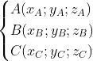
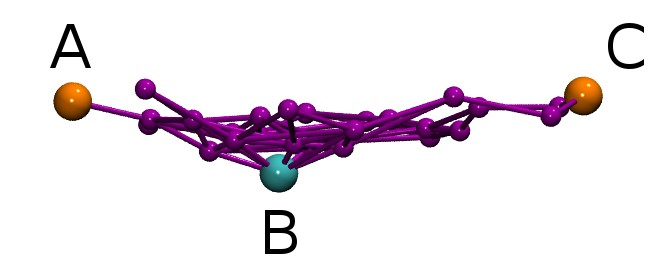
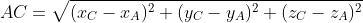

# memb-curve

## Theory

The aim of this programme is to determine a value for the local curvature of a membrane induced by the adsorption of an agent (protein, DNA, molecule, molecular aggregate, etc.) on its surface. The radius of curvature is identified through a spherical fit of the contacting moities at the membrane vicinity.
Three points A,B and C are considered:

Two criteria must be taken into account. First, the membrane is located in the xOy plane. Second, points A, B, and C must be within 5 A of the molecule for which you wish to calculate the local curvature. For representing the polar moieties of phospholipicds, only phorsphorus atoms are considered. It is important to note that these criteria may vary depending on the initial orientation of the membrane or the type of macromolecule of interest. A network of points are then obtained and displayed below.

The program identifies point B as the one that is the most deeply embedded in the membrane. Points A and C are then selected so that their distance is as large as possible. The AC distances are computed through:

## Method

